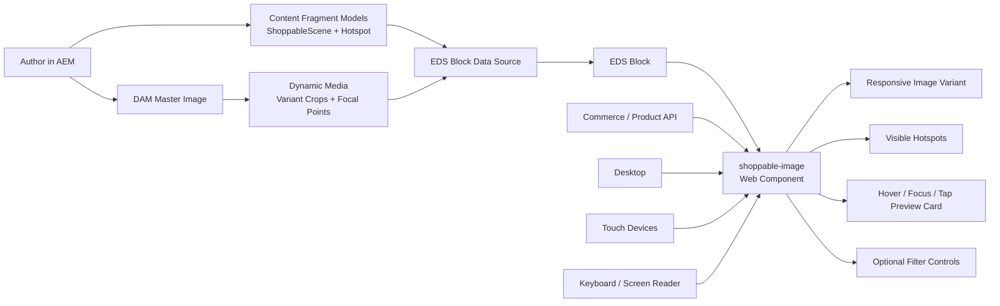

# Shoppable Image EDS Block

This document describes the plan for building a shoppable image experience as an Edge Delivery Services block that boots a web component for the interactive hotspot experience. The frontend is responsible for rendering and interaction, AEM Content Fragments own scene and hotspot metadata, and AEM with Dynamic Media manages responsive image delivery, crop variants, and focal-point-aware renditions.

## Goal

- Reproduce a modern shoppable image pattern with visible hotspots and compact product teaser cards.
- Support hover and focus preview cards on desktop plus tap interactions on touch devices.
- Support multiple crops, aspect ratios, and focal points through Dynamic Media without forcing the frontend to guess hotspot placement.

## Architecture Overview

- The EDS block provides the block contract and page-level integration.
- The block reads authored scene data and initializes a custom element such as `shoppable-image`.
- The web component owns rendering, interaction state, filtering, responsive behavior, and preview-card positioning.
- AEM Content Fragments provide authored metadata for scenes, hotspots, and optional editorial enrichment.
- Dynamic Media provides image URLs for responsive variants and crop-aware delivery.
- Commerce or product services provide live product facts such as price, stock, and canonical product URLs.

## System Diagram



## Scope

In scope:

- EDS block contract and progressive-enhancement markup
- Custom element behavior and rendering
- Content model and frontend payload contract
- Responsive image strategy with Dynamic Media variants
- Hotspot interactions, filtering, and accessibility behavior
- Crop-aware coordinates across multiple aspect ratios

Out of scope:

- Backend commerce implementation
- Full authoring UI implementation
- Detailed AEM workflow configuration beyond the metadata contract

## User Experience

- All hotspots are visible by default so users retain spatial context.
- Only one hotspot is active at a time.
- Hover or keyboard focus opens a compact teaser card with product name, type, price, and a CTA affordance.
- Tap toggles teaser cards on touch devices.
- Optional filter controls dim or hide non-matching hotspots.
- A non-visual list fallback remains available for accessibility and no-JavaScript resilience.

## EDS Block Design

- Implement the feature as a standard EDS block that can consume either authored JSON or server-rendered block markup derived from Content Fragment data.
- The block should progressively enhance instead of requiring JavaScript for the base image and hotspot list content.
- The block script is responsible for mapping authored data into the component input contract and instantiating the custom element.
- The block should keep its responsibilities thin: normalize data, mount the component, and expose fallback markup.

## Web Component Design

The custom element owns:

- current variant selection
- active hotspot selection
- filter state
- keyboard, pointer, hover, and touch interaction
- teaser-card placement logic
- hotspot rendering and responsive updates

Implementation expectations:

- Render semantic HTML inside the component.
- Expose configuration through a single JSON payload property or equivalent normalized data input.
- Avoid framework assumptions so the component can live comfortably inside an EDS block.
- Preserve accessible relationships between hotspots, preview cards, and any fallback list representation.

## Data Model

### `ShoppableScene`

- `id`
- `title`
- `subtitle`
- `altText`
- `sceneTags`
- `imageVariants`
- `hotspots`

### `Hotspot`

- `id`
- `sku`
- `previewPlacement`
- `priority`
- `filterTags`
- `labelOverride`
- `variantCoordinates`

Optional editorial enrichment may be added only where needed, but live commerce data such as price and stock should be resolved externally by SKU.

## Dynamic Media Strategy

- Store a single master asset in AEM/DAM.
- Use Dynamic Media to deliver responsive renditions for named variants such as `portrait`, `square`, `landscape`, and `hero`.
- Each variant may define:
  - an explicit crop definition
  - focal point metadata
  - a Dynamic Media delivery URL
  - target width and height metadata
- The frontend should render variants through `picture` or an equivalent responsive source selection pattern.
- Dynamic Media controls image composition, while the component consumes variant metadata already resolved for delivery.

## Crop and Coordinate Strategy

Crop-aware behavior is a first-class requirement.

- Hotspots should default to variant-specific coordinates rather than master-image coordinate transformation.
- Each hotspot stores coordinates for every supported variant.
- Focal points inform image composition, but hotspot placement remains explicit per variant.
- If a variant coordinate is missing for a hotspot, the hotspot is hidden for that variant instead of being guessed.
- This keeps the implementation predictable and avoids drift between crops, focal points, and teaser-card placement.

## Rendering Contract

The following interfaces are proposed for implementation planning. They are not existing repo code.

```json
{
  "scene": {
    "id": "bedroom-storage-look-01",
    "title": "Bedroom storage look",
    "subtitle": "A compact room scene with visible hotspots",
    "altText": "Bedroom scene with wardrobe, dresser and bed",
    "sceneTags": ["bedroom", "storage", "modern"],
    "variants": [
      {
        "name": "portrait",
        "aspectRatio": "4:5",
        "dmUrl": "https://delivery.example/portrait",
        "width": 1200,
        "height": 1500,
        "cropMode": "crop",
        "focalPoint": {
          "x": 0.58,
          "y": 0.44
        }
      },
      {
        "name": "landscape",
        "aspectRatio": "16:9",
        "dmUrl": "https://delivery.example/landscape",
        "width": 1600,
        "height": 900,
        "cropMode": "smartcrop",
        "focalPoint": {
          "x": 0.58,
          "y": 0.44
        }
      }
    ],
    "hotspots": [
      {
        "id": "mirror-01",
        "sku": "20458615",
        "previewPlacement": "left",
        "priority": 20,
        "filterTags": ["mirror", "decor"],
        "labelOverride": "LINDBYN",
        "variantCoordinates": [
          {
            "variantName": "portrait",
            "xPercent": 34.9,
            "yPercent": 29.1
          },
          {
            "variantName": "landscape",
            "xPercent": 28.4,
            "yPercent": 35.2
          }
        ]
      }
    ]
  },
  "filters": [
    { "id": "all", "label": "All" },
    { "id": "decor", "label": "Decor" },
    { "id": "storage", "label": "Storage" }
  ]
}
```

### `scene`

- `id`
- `title`
- `subtitle`
- `altText`
- `sceneTags[]`
- `variants[]`
- `hotspots[]`

### `variant`

- `name`
- `aspectRatio`
- `dmUrl`
- `width`
- `height`
- `cropMode`
- `focalPoint`

### `hotspot`

- `id`
- `sku`
- `previewPlacement`
- `priority`
- `filterTags[]`
- `labelOverride`
- `variantCoordinates[]`

### `variantCoordinate`

- `variantName`
- `xPercent`
- `yPercent`

Variant-specific coordinates are the default implementation choice.

## Authoring Plan

- Authors manage scene and hotspot metadata in Content Fragments.
- Authors choose supported Dynamic Media variants for each scene.
- Authors define hotspot positions per variant rather than once against the master image.
- Authors may override teaser-card placement and apply filter tags for presentation-tier filtering.
- Optional enrichment fields can add editorial labels or merchandising copy without replacing live commerce truth.

## Content Fragment UI Extension Strategy

It should be possible to extend the Content Fragment authoring experience so hotspot positions are visually defined against the image and persisted as JSON in the fragment.

Recommended approach:

- Keep stable editorial data in normal Content Fragment fields.
- Store hotspot layout geometry in a dedicated JSON field such as `hotspotLayoutJson`.
- Use a custom authoring extension to render the image, let authors place hotspots visually, and serialize the result back into the fragment.

### AEM CF Editor extension approach

The recommended implementation is to use Adobe UI Extensibility for the AEM Content Fragment Editor and combine these extension points:

- custom form element rendering
- modal dialogs
- optional Properties Rail panel

Use custom form element rendering to replace a JSON-backed field such as `hotspotLayoutJson` with a purpose-built hotspot editor launcher and summary view. That custom field renderer becomes the persistence bridge between the Content Fragment editor and the visual hotspot editor.

Recommended interaction model:

- The Content Fragment editor renders the normal `ShoppableScene` fields.
- The `hotspotLayoutJson` field is replaced by a custom renderer.
- The custom renderer shows:
  - current hotspot count
  - configured variants
  - validation state
  - an `Open hotspot editor` action
- The full visual authoring canvas opens in a modal dialog for editing.
- The modal saves changes back into `hotspotLayoutJson`.
- The standard Content Fragment save persists the JSON with the fragment.

### Responsibilities by extension point

#### Custom form element rendering

Use this extension point to:

- match and replace the `hotspotLayoutJson` field
- read the current field value
- write updated JSON back to the field
- surface validation and summary information inline in the editor

This field-level extension should be treated as the source of truth for in-session hotspot edits.

#### Modal dialog

Use a modal dialog for the visual editing surface because hotspot authoring needs more space than an inline field can comfortably provide.

The modal should provide:

- image canvas preview
- variant switching
- click-to-add hotspot
- drag-to-position hotspot
- hotspot metadata editing
- overlap and bounds warnings
- save and cancel actions

#### Properties Rail

An optional Properties Rail panel can complement the modal by showing:

- hotspot list and selection state
- validation issues
- quick metadata edits
- variant coverage warnings

The rail should be secondary, not the primary visual editing surface.

### Recommended `ShoppableScene` fields

- `title`
- `subtitle`
- `sceneImage`
- `altText`
- `sceneTags`
- `supportedVariants`
- `hotspotLayoutJson`
- optional `hotspotLayoutVersion`

### Authoring extension behaviour

- Load the selected scene image from AEM/DAM.
- Load the configured variants such as `portrait`, `square`, and `landscape`.
- Let the author switch between variant previews.
- Support click-to-add and drag-to-adjust hotspot placement.
- Allow each hotspot to edit:
  - `id`
  - `sku`
  - `labelOverride`
  - `previewPlacement`
  - `priority`
  - `filterTags`
- Persist the full layout state into the JSON field.
- Validate out-of-bounds coordinates, overlapping dots, and missing coordinates for required variants.

### Persistence flow

- The custom field renderer loads the current `hotspotLayoutJson` value.
- The author opens the modal hotspot editor.
- The modal edits hotspot state in memory against the selected image variant.
- On save, the modal serializes the updated layout JSON.
- The custom field renderer pushes the new JSON value back into the fragment field.
- The normal Content Fragment save operation persists the fragment.

### Why this extension model fits

- It keeps the hotspot editor close to the fragment data that owns it.
- It avoids forcing authors to edit raw JSON.
- It uses supported AEM CF Editor extension points rather than replacing the entire editor experience.
- It keeps structured fragment fields usable for search and governance while still allowing rich visual layout editing.

### Recommended JSON shape

```json
{
  "version": 1,
  "variants": [
    {
      "name": "portrait",
      "aspectRatio": "4:5",
      "dmPreset": "portrait",
      "focalPoint": { "x": 0.58, "y": 0.44 }
    },
    {
      "name": "landscape",
      "aspectRatio": "16:9",
      "dmPreset": "landscape",
      "focalPoint": { "x": 0.58, "y": 0.44 }
    }
  ],
  "hotspots": [
    {
      "id": "mirror-01",
      "sku": "20458615",
      "labelOverride": "LINDBYN",
      "previewPlacement": "left",
      "priority": 20,
      "filterTags": ["decor", "mirror"],
      "coordinates": [
        { "variant": "portrait", "xPercent": 34.9, "yPercent": 29.1 },
        { "variant": "landscape", "xPercent": 28.4, "yPercent": 35.2 }
      ]
    }
  ]
}
```

This hybrid model is preferred over putting all authored content into a single opaque blob. Content Fragment fields remain useful for search, governance, and delivery, while JSON handles the layout-specific hotspot geometry.

### Consumption model

- The EDS block reads the Content Fragment fields and `hotspotLayoutJson`.
- The block resolves image references and Dynamic Media URLs.
- The block passes the normalized payload into the `shoppable-image` web component.
- The component renders only the hotspot coordinates for the active variant.
- If a hotspot has no coordinate for the active variant, it is hidden for that variant.

## Implementation Plan

### Phase 1: Define models and payload contract

- Define the Content Fragment model structure for `ShoppableScene` and `Hotspot`.
- Define the EDS block to web component handoff payload.
- Confirm how live product data is resolved by SKU.
- Decide the JSON field name and versioning strategy for hotspot layout persistence.

### Phase 2: Build the EDS block scaffold

- Create the block markup contract and fallback structure.
- Normalize authored data into the runtime payload.
- Mount the custom element with progressive enhancement.

### Phase 3: Build the web component

- Render the active image variant and hotspot markers.
- Implement hover, focus, touch, and keyboard interactions.
- Implement teaser-card display and active hotspot state.

### Phase 4: Integrate Dynamic Media variants

- Add responsive source selection for named variants.
- Switch hotspot coordinates when the active variant changes.
- Validate focal-point-aware delivery and crop behavior.

### Phase 5: Add filtering and accessibility

- Add optional filter controls and hotspot dimming/hiding rules.
- Add accessible list fallback and keyboard traversal.
- Confirm screen reader labels and focus handling for teaser cards and hotspots.

### Phase 6: Validate with authored content

- Test against real Content Fragment payloads and Dynamic Media renditions.
- Confirm behavior across portrait, square, landscape, and hero variants.
- Confirm that missing variant coordinates safely hide the hotspot for that variant.
- Confirm that authoring changes in the Content Fragment UI extension persist cleanly and reload without loss.

## Assumptions

- The component is delivered as an EDS block with a custom element enhancement.
- Metadata is owned by AEM Content Fragments.
- Dynamic Media owns image rendition delivery.
- Commerce services own live product facts such as price and availability.
- The variant-specific coordinate approach is preferred over runtime coordinate transformation.
